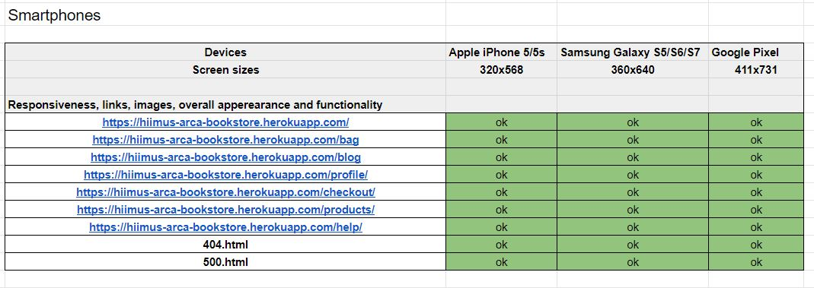

# Testing

# Table Of Contents

1. [Code Validation](#code-validation)
2. [Responsiveness](#responsiveness)
3. [Browser Compatibility and Functional Testing](#browser-compatibility-and-functional-testing)
4. [User Stories Testing](#user-stories-testing)
5. [Solved Bugs](#solved-bugs)
6. [Unsolved Bugs](#unsolved-bugs)

# Code Validation

## HTML5
#### How:
- I used the [W3C Html Validator](https://validator.w3.org/) I validated via URI, to prevent errors from template language. I added the deployed site's link and tried to validate all my urls.

- Results:
    - No errors.

## CSS3
#### How:
- I could propably do it the same way as I did with the html validation, but there where no templating language I had to consider, so I just found all my css files, copied the css and pasted it via direct input with the [W3C CSS Validation](https://jigsaw.w3.org/css-validator/#validate_by_input).
- Results:
    - No errors.

## JavaScript
#### How: 
- I used [JSHint](https://jshint.com/) and found all scripts and js files and copied and pasted the JavaScript code. 
- Results: 
    - No erros.

## Python
#### How:
- I used flake8 in the IDE. I typed the command `flake8 --count` in the terminal and it counts all the errors. I then went through all of them and corrected as many as possible.
- Results:
- Almost all the error where line too long, and this was mostly on the migration files. The errors on the migration files I choose to ignore. Other than the migration files, I had a couple of errors I will talk more about:
- env.py errors: These I choose to ignore.
- vscode/arctictern.py errors: These I will ignore since I can't see them and I they are most likely generated from a Code Institue template.
- settings.py errors: line too long, these I can't really fix due to long strings so I will ignore them.
- /bag/urls.py:2:20: W291 trailing whitespace: This I have tried to fix, but even though I have removed the trailing whitespace, the error will not go away. I have even copied and pasted a file that is identical, yet the error is still there. I choose to ignore it.
- /checkout/apps.py:8:9: F401 'checkout.signals' imported but unused: This I choose to ignore because it was added by following Boutique Ado, and I think removing this will break the site. Also, I checked it with the [PEP8](http://pep8online.com/), and it was fine.
checkout/webhooks.py:33:5: F841 local variable 'e' is assigned to but never used: This I choose to ignore because I can't seem to fix it and [PEP8](http://pep8online.com/) says it's fine.  

<a href="#arca-bookstore">BACK TO TOP</a>

# Responsiveness
Responsiveness was tested with [Responsive Design Checker](https://responsivedesignchecker.com/) and [Google Devtools](https://google.com/). Various devices and screen sizes was tested. Note:

- Throughout the project I have adjusted the screen size in one of the window corners for a quick responsiveness check. See below for an overview of responsiveness testing:

### Testing for smartphones:

  
Smartphone test

  

### Testing for tablets:

  
Tablet test

  

### Testing for desktops:

  
Desktop test

  

<a href="#arca-bookstore">BACK TO TOP</a>

# Browser Compatibility and Functional Testing

The site's features such as adding products, ordering, buying products, adding reviews, commenting, deleting, editing was tested on all browsers. Registering, logging in, signing out and forgot password was also tested. All links, 404 and 500 pages were also tested. 

  
Browser test

  

<a href="#arca-bookstore">BACK TO TOP</a>

# User Stories Testing

## Common User Stories

#### Non-Registered Users
- As a non-registered user I want to browse multiple products so that I can look without narrowing down a search.
    - A non-registered user can browse multiple product either from the home page, where the user can see a sample of products from different categories. From here the non-registered user have many options on browsing multiple products. The user can either click on the products links in the navbar/main nav, click on the "Click here to see all books" hyperlink, or click on one of the category images.
     

  
Browsing Products

  

- As a non-registered user I want to view more details of a product so that I can get more information about the product.
    - A non-registered user can view more details of a product by clicking a product card. Once clicked, the user will be directed to the product details page of that product. Here the user will find much more detailed information about the product.

  
View more details of a product

  

- As a non-registered user I want to be able to do a search so that I can find the product I am looking for.
    - A non-registered user is able to do a search from the search bar in the navbar/main nav.

  
Searching from the navbar

  

  
Searching from the hamburger menu

  

- As a non-registered user I want to add products to a shopping bag/cart so that I can select multiple products and view them in the bag.
    - A non-registered user can add products to a shopping bag from the product details page. From here the user can view the shopping bag either from clicking on the message container on the top right corner, or by clicking on the shopping bag icon from the navbar/main nav.

  
Adding products to a bag

  

- As a non-registered user I want to view to see the total price of the products in the bag so that I can have control of my spendings.
    - A non-registered user is able to see the total price of the products on the shopping bag page, and also on the checkout page.

  
See the price in the shopping bag

  

- As a non-registered user I want to select categories so that I can find multiple products within a category.
    - A non-registered can select categories from the products page.

  
Select a category

  

#### Registered Users
- As a registered user I want to view my order history so that I can see my previous orders.
    - A registered user is able to view the order history by clicking on the profiles page from the navbar/main nav. Once on this page the registered user can see all orders. Also, by clicking on the hyperlink order number, the registered user can view all information about the order, including delivery information.

  
View order history

  

- As a registered user I want to be able to edit my personal information and shipping information so that I can change it if I want to.
    - A registered can edit their personal information from the profile page. The registered user can simply type in the input fields and click on the green "Update Information" button.

  
Edit personal information

  

- As a registered user I want to reset my password so that I can change it or enter a new one if I forget the old password.
    - A registered user can reset the password by clicking "Log in" in the navbar/main nav and then click the "Forgot Password?" link. Once on this page, the registered user must provide the email address linked to Arca Bookstore and then click on the "Reset My Password" button.

  
Reset the password step.1

  

  
Reset the password step.2

  

  
Reset the password step.3

  

#### Superusers
- As a superuser I want to add products so that I can display a product on the site.
    - A superuser can add products by first logging in, and then click "My Account" in the navbar/main nav, then "Add a Product". From this page, simply fill out the required fields, and click on the green "Add Product" button.

  
Adding a product

  

- As a superuser I want to edit a product so that I can change or add something if I want to. 
    - A superuser can edit a product from the homepage, all products page, all product pages and on the product details page. Once the superuser is logged in, an "Edit" link is displayed on each product card. The superuser can click this link and will be directed to the edit page. Once on this page, all the product information currently saved to that product will already be filled out. Once the superuser has made changes, simply click on the "Update Product" button to save the changes.

  
Editing a product

  

- As a superuser I want to delete a product so that I can remove the product if I want to.
    - A superuser can delete a product by accessing the same pages as when editing a prodcuct. The only difference is the superuser must click on the red "Delete" link instead.

<a href="#arca-bookstore">BACK TO TOP</a>

# Bugs

## Solved Bugs

### Footer

I have had a frustrating time with the footer to behave on all pages. The issue was when there was much vs little content on the page. The footer would cover some content, and it would suddenly stick to the top of the page. A [Stack overflow](https://stackoverflow.com/questions/2744690/preventing-fixed-footer-from-overlapping-content) thread helped me fix the issue with overlapping content. 

### Shopping Bag
In the shopping bag page the site would crash if not whole numbers was added, i.e 1.5. This [Stack overflow](https://stackoverflow.com/questions/37043867/how-to-avoid-decimal-values-in-input-type-number) thread helped me solve it by adding some JavaScript that only allow whole numbers.

### Favicon
The favicon generated errors in the console in production mode, but not on the deployed site. I found a helpful fix for it that removed the error. I just needed to add crossorigin="use-credentials" in the html link. This removed the error in the console in production mode, but made the error appear in the deployed version. I concluded that deployed version is what is important, so I removed the "fix". This might issue might also be under the section of "Unsolved Bugs", but it doesn't bother me if the favicon actually works and doesn't raise any errors in the console.

### Screen Flickering
For some reason, on some pages the screen was flickering when hovering over elements that had a hover effect. This [Github](https://github.com/jackmoore/autosize/issues/307) thread helped me fix it by adding `overlfow: scroll` to the body in the base.html.

## Unsolved Bugs

### Login
On the login page, there is an option to use the "Remember me" checkbox. This works in production, but not on the deployed site. I noticed this just before the deadline and I didn't find a solution to the problem.

<a href="#arca-bookstore">BACK TO TOP</a>
